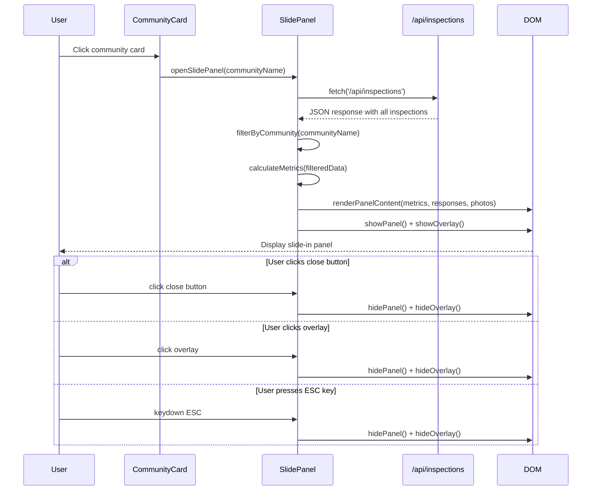

# Design Document: Community Details Slide-In Panel

## Overview

The Community Details Slide-In Panel is a modern UI component that displays detailed visit information for a selected community in the ATLAS dashboard. When a user clicks on a community card, a panel smoothly slides in from the right side of the screen with a dark overlay, providing an immersive detail view without navigating away from the dashboard. The panel displays comprehensive visit data including community information, score metrics, action items, response details with conditions, and photos from the visit.

This design leverages existing CSS styles already present in dashboard.html and integrates seamlessly with the current vanilla JavaScript architecture and Flask backend API endpoints.

## Main Algorithm/Workflow



## Architecture

```mermaid
graph TD
    A[Dashboard View] --> B[Community Cards Grid]
    B --> C[Community Card Component]
    C --> D[Click Event Handler]
    D --> E[openSlidePanel Function]
    E --> F[Data Fetcher]
    F --> G[/api/inspections Endpoint]
    G --> F
    F --> H[Data Processor]
    H --> I[Metrics Calculator]
    H --> J[Response Grouper]
    H --> K[Photo Collector]
    I --> L[Panel Renderer]
    J --> L
    K --> L
    L --> M[Slide Panel DOM]
    M --> N[Panel Header]
    M --> O[Panel Body]
    O --> P[Stats Section]
    O --> Q[Responses Section]
    O --> R[Photos Section]
    
    S[Close Handlers] --> T[Close Button]
    S --> U[Overlay Click]
    S --> V[ESC Key]
    T --> W[closeSlidePanel Function]
    U --> W
    V --> W
    W --> X[Hide Panel + Overlay]
```

## Components and Interfaces

### Component 1: SlidePanel Manager

**Purpose**: Manages the lifecycle of the slide-in panel including opening, closing, data fetching, and rendering.

**Interface**:
```javascript
interface SlidePanelManager {
  openSlidePanel(communityName: string): Promise<void>
  closeSlidePanel(): void
  renderPanelContent(data: CommunityDetailData): void
  attachEventListeners(): void
}
```

**Responsibilities**:
- Fetch inspection data from API
- Filter data by community name
- Calculate metrics (score, action items, response counts)
- Render panel HTML with data
- Handle open/close animations
- Manage event listeners for close actions

### Component 2: Data Processor

**Purpose**: Processes raw inspection data into structured format for panel display.

**Interface**:
```javascript
interface DataProcessor {
  filterByCommunity(inspections: Inspection[], communityName: string): Inspection[]
  calculateScore(inspections: Inspection[]): number | null
  countActionItems(inspections: Inspection[]): number
  groupResponsesByCondition(inspections: Inspection[]): ResponseGroup[]
  extractPhotos(inspections: Inspection[]): Photo[]
}
```

**Responsibilities**:
- Filter inspections by community
- Calculate average score percentage
- Count action items (Fail, Opportunity conditions)
- Group responses by condition type
- Extract and deduplicate photos

### Component 3: Panel Renderer

**Purpose**: Generates HTML markup for panel sections.

**Interface**:
```javascript
interface PanelRenderer {
  renderHeader(communityName: string, lastVisitDate: string): string
  renderStats(score: number | null, actionItems: number): string
  renderResponses(responses: ResponseGroup[]): string
  renderPhotos(photos: Photo[]): string
  renderEmptyState(message: string): string
}
```

**Responsibilities**:
- Generate semantic HTML for each panel section
- Apply appropriate CSS classes and styles
- Handle empty states gracefully
- Ensure accessibility attributes (ARIA labels)

### Component 4: Event Handler

**Purpose**: Manages user interactions with the panel.

**Interface**:
```javascript
interface EventHandler {
  onCloseButtonClick(event: MouseEvent): void
  onOverlayClick(event: MouseEvent): void
  onEscapeKey(event: KeyboardEvent): void
  onCommunityCardClick(event: MouseEvent): void
}
```

**Responsibilities**:
- Handle close button clicks
- Handle overlay clicks
- Handle ESC key presses
- Handle community card clicks
- Prevent event bubbling where needed

## Data Models

### Model 1: Inspection

```javascript
interface Inspection {
  id: number
  community: string
  questionText: string
  condition: 'Excellence' | 'Pass' | 'Opportunity' | 'Fail' | 'Good' | 'Needs Attention'
  description: string
  photoPath: string | null
  timestamp: string
  username: string
  surveyTypeId: string | null
}
```

**Validation Rules**:
- `community` must be non-empty string
- `condition` must be one of the allowed enum values
- `timestamp` must be valid date string
- `photoPath` must be valid relative path or null

### Model 2: CommunityDetailData

```javascript
interface CommunityDetailData {
  communityName: string
  lastVisitDate: string
  score: number | null
  actionItems: number
  responses: ResponseGroup[]
  photos: Photo[]
  totalResponses: number
}
```

**Validation Rules**:
- `communityName` must match a community card's name
- `score` must be between 0-100 or null
- `actionItems` must be non-negative integer
- `responses` array can be empty but not null
- `photos` array can be empty but not null

### Model 3: ResponseGroup

```javascript
interface ResponseGroup {
  condition: string
  conditionClass: string
  conditionIcon: string
  questionText: string
  description: string
  photoPath: string | null
  timestamp: string
}
```

**Validation Rules**:
- `condition` must be valid condition type
- `conditionClass` must be valid CSS class name
- `conditionIcon` must be valid Font Awesome icon class

### Model 4: Photo

```javascript
interface Photo {
  path: string
  alt: string
  timestamp: string
}
```

**Validation Rules**:
- `path` must be valid relative path starting with '/'
- `alt` must be descriptive text
- `timestamp` must be valid date string

## Algorithmic Pseudocode

### Main Panel Opening Algorithm

```pascal
ALGORITHM openSlidePanel(communityName)
INPUT: communityName of type String
OUTPUT: None (side effect: displays panel)

BEGIN
  ASSERT communityName ≠ ∅ AND communityName ≠ null
  
  // Step 1: Fetch inspection data
  response ← AWAIT fetch('/api/inspections')
  
  IF response.ok = false THEN
    DISPLAY error message to user
    RETURN
  END IF
  
  allInspections ← AWAIT response.json()
  
  // Step 2: Filter by community
  communityInspections ← EMPTY_ARRAY
  FOR each inspection IN allInspections DO
    IF inspection.community = communityName THEN
      communityInspections.ADD(inspection)
    END IF
  END FOR
  
  // Step 3: Check if data exists
  IF communityInspections.length = 0 THEN
    renderEmptyState("No visit data available for this community")
    showPanel()
    RETURN
  END IF
  
  // Step 4: Calculate metrics
  score ← calculateScore(communityInspections)
  actionItems ← countActionItems(communityInspections)
  lastVisitDate ← getLatestTimestamp(communityInspections)
  
  // Step 5: Process responses
  responses ← groupResponsesByCondition(communityInspections)
  
  // Step 6: Extract photos
  photos ← extractPhotos(communityInspections)
  
  // Step 7: Build data object
  detailData ← {
    communityName: communityName,
    lastVisitDate: lastVisitDate,
    score: score,
    actionItems: actionItems,
    responses: responses,
    photos: photos,
    totalResponses: communityInspections.length
  }
  
  // Step 8: Render and display
  renderPanelContent(detailData)
  showPanel()
  showOverlay()
  
  ASSERT panel.classList.contains('show') = true
  ASSERT overlay.classList.contains('show') = true
END
```

**Preconditions:**
- `communityName` is a valid non-empty string
- DOM elements for panel and overlay exist
- `/api/inspections` endpoint is accessible
- User is authenticated

**Postconditions:**
- Panel is visible with 'show' class
- Overlay is visible with 'show' class
- Panel contains rendered community data
- Event listeners are attached for closing
- Body scroll is optionally disabled

**Loop Invariants:**
- All processed inspections belong to the specified community
- All photos in the photos array have valid paths

### Score Calculation Algorithm

```pascal
ALGORITHM calculateScore(inspections)
INPUT: inspections of type Array<Inspection>
OUTPUT: score of type Number or null

BEGIN
  ASSERT inspections ≠ null
  
  IF inspections.length = 0 THEN
    RETURN null
  END IF
  
  totalScore ← 0
  scoredCount ← 0
  
  FOR each inspection IN inspections DO
    conditionScore ← getConditionScore(inspection.condition)
    
    IF conditionScore ≠ null THEN
      totalScore ← totalScore + conditionScore
      scoredCount ← scoredCount + 1
    END IF
  END FOR
  
  IF scoredCount = 0 THEN
    RETURN null
  END IF
  
  averageScore ← totalScore / scoredCount
  
  ASSERT averageScore ≥ 0 AND averageScore ≤ 100
  
  RETURN ROUND(averageScore)
END

FUNCTION getConditionScore(condition)
INPUT: condition of type String
OUTPUT: score of type Number or null

BEGIN
  CASE condition OF
    'Excellence': RETURN 100
    'Pass': RETURN 75
    'Good': RETURN 75
    'Opportunity': RETURN 50
    'Needs Attention': RETURN 25
    'Fail': RETURN 0
    DEFAULT: RETURN null
  END CASE
END
```

**Preconditions:**
- `inspections` is a valid array (can be empty)
- Each inspection has a valid `condition` field

**Postconditions:**
- Returns null if no inspections or no scoreable conditions
- Returns integer between 0-100 if score is calculable
- Score is rounded to nearest integer

**Loop Invariants:**
- `totalScore` is sum of all processed condition scores
- `scoredCount` equals number of inspections with valid scores

### Action Items Counting Algorithm

```pascal
ALGORITHM countActionItems(inspections)
INPUT: inspections of type Array<Inspection>
OUTPUT: count of type Integer

BEGIN
  ASSERT inspections ≠ null
  
  actionConditions ← ['Fail', 'Opportunity', 'Needs Attention']
  count ← 0
  
  FOR each inspection IN inspections DO
    IF inspection.condition IN actionConditions THEN
      count ← count + 1
    END IF
  END FOR
  
  ASSERT count ≥ 0
  ASSERT count ≤ inspections.length
  
  RETURN count
END
```

**Preconditions:**
- `inspections` is a valid array (can be empty)
- Each inspection has a valid `condition` field

**Postconditions:**
- Returns non-negative integer
- Count is less than or equal to total inspections
- Only counts Fail, Opportunity, and Needs Attention conditions

**Loop Invariants:**
- `count` represents number of action items found so far
- `count` never exceeds current iteration index

### Panel Closing Algorithm

```pascal
ALGORITHM closeSlidePanel()
INPUT: None
OUTPUT: None (side effect: hides panel)

BEGIN
  panel ← document.querySelector('.slide-panel')
  overlay ← document.querySelector('.slide-panel-overlay')
  
  ASSERT panel ≠ null
  ASSERT overlay ≠ null
  
  // Remove show classes to trigger CSS transitions
  panel.classList.remove('show')
  overlay.classList.remove('show')
  
  // Re-enable body scroll if it was disabled
  document.body.style.overflow ← 'auto'
  
  ASSERT panel.classList.contains('show') = false
  ASSERT overlay.classList.contains('show') = false
END
```

**Preconditions:**
- Panel and overlay DOM elements exist
- Panel may or may not be currently visible

**Postconditions:**
- Panel does not have 'show' class
- Overlay does not have 'show' class
- Body scroll is re-enabled
- CSS transitions handle animation

## Key Functions with Formal Specifications

### Function 1: openSlidePanel()

```javascript
async function openSlidePanel(communityName)
```

**Preconditions:**
- `communityName` is a non-empty string
- DOM elements `.slide-panel` and `.slide-panel-overlay` exist
- `/api/inspections` endpoint is accessible
- User has valid authentication session

**Postconditions:**
- If data exists: Panel displays with community details
- If no data: Panel displays empty state message
- Panel has 'show' class applied
- Overlay has 'show' class applied
- Event listeners are attached for close actions
- If API fails: Error message is shown to user

**Loop Invariants:** N/A (async function with sequential operations)

### Function 2: closeSlidePanel()

```javascript
function closeSlidePanel()
```

**Preconditions:**
- Panel and overlay DOM elements exist
- Function can be called regardless of panel visibility state

**Postconditions:**
- Panel 'show' class is removed
- Overlay 'show' class is removed
- Body scroll is restored
- No memory leaks from event listeners

**Loop Invariants:** N/A (no loops)

### Function 3: renderPanelContent()

```javascript
function renderPanelContent(data)
```

**Preconditions:**
- `data` is a valid CommunityDetailData object
- `data.communityName` is non-empty string
- `data.responses` is an array (can be empty)
- `data.photos` is an array (can be empty)
- Panel body DOM element exists

**Postconditions:**
- Panel body innerHTML is updated with rendered content
- All sections (header, stats, responses, photos) are rendered
- Empty states are shown for empty arrays
- All HTML is properly escaped to prevent XSS
- ARIA labels are applied for accessibility

**Loop Invariants:**
- For response rendering: All rendered responses have valid condition classes
- For photo rendering: All rendered photos have valid src paths

### Function 4: attachEventListeners()

```javascript
function attachEventListeners()
```

**Preconditions:**
- Panel, overlay, and close button DOM elements exist
- Function is called after panel is rendered

**Postconditions:**
- Close button has click event listener
- Overlay has click event listener
- Document has keydown event listener for ESC key
- All listeners properly call closeSlidePanel()
- Event listeners prevent default behavior where needed

**Loop Invariants:** N/A (no loops)

## Example Usage

```javascript
// Example 1: Opening panel from community card click
document.querySelectorAll('.community-card').forEach(card => {
  card.addEventListener('click', function() {
    const communityName = this.querySelector('.card-title').textContent.trim()
    openSlidePanel(communityName)
  })
})

// Example 2: Closing panel with close button
document.querySelector('.slide-panel-close').addEventListener('click', function() {
  closeSlidePanel()
})

// Example 3: Closing panel with overlay click
document.querySelector('.slide-panel-overlay').addEventListener('click', function() {
  closeSlidePanel()
})

// Example 4: Closing panel with ESC key
document.addEventListener('keydown', function(e) {
  if (e.key === 'Escape') {
    const panel = document.querySelector('.slide-panel')
    if (panel.classList.contains('show')) {
      closeSlidePanel()
    }
  }
})

// Example 5: Complete workflow with error handling
async function openSlidePanel(communityName) {
  try {
    const response = await fetch('/api/inspections')
    
    if (!response.ok) {
      throw new Error('Failed to fetch inspections')
    }
    
    const allInspections = await response.json()
    const communityInspections = allInspections.filter(
      item => item.community === communityName
    )
    
    if (communityInspections.length === 0) {
      renderEmptyState('No visit data available')
      showPanel()
      return
    }
    
    const data = {
      communityName: communityName,
      lastVisitDate: getLatestDate(communityInspections),
      score: calculateScore(communityInspections),
      actionItems: countActionItems(communityInspections),
      responses: groupResponses(communityInspections),
      photos: extractPhotos(communityInspections),
      totalResponses: communityInspections.length
    }
    
    renderPanelContent(data)
    showPanel()
    showOverlay()
    
  } catch (error) {
    console.error('Error opening slide panel:', error)
    alert('Failed to load community details. Please try again.')
  }
}
```

## Correctness Properties

### Property 1: Panel Visibility Consistency
**Universal Quantification:**
```
∀ panel_state ∈ PanelStates:
  (panel.classList.contains('show') = true) ⟺ (overlay.classList.contains('show') = true)
```
**Description:** The panel and overlay must always be in sync - both visible or both hidden.

### Property 2: Data Integrity
**Universal Quantification:**
```
∀ inspection ∈ displayedInspections:
  inspection.community = selectedCommunityName
```
**Description:** All inspections displayed in the panel must belong to the selected community.

### Property 3: Score Validity
**Universal Quantification:**
```
∀ score ∈ CalculatedScores:
  (score = null) ∨ (0 ≤ score ≤ 100)
```
**Description:** Calculated scores must be either null (no data) or within valid percentage range.

### Property 4: Action Items Accuracy
**Universal Quantification:**
```
∀ community ∈ Communities:
  actionItemCount(community) = |{i ∈ inspections(community) | i.condition ∈ {'Fail', 'Opportunity', 'Needs Attention'}}|
```
**Description:** Action item count must equal the number of inspections with action-requiring conditions.

### Property 5: Close Handler Idempotency
**Universal Quantification:**
```
∀ n ∈ ℕ:
  closeSlidePanel()^n ≡ closeSlidePanel()
```
**Description:** Calling closeSlidePanel multiple times has the same effect as calling it once.

### Property 6: Photo Path Validity
**Universal Quantification:**
```
∀ photo ∈ displayedPhotos:
  photo.path ≠ null ⟹ photo.path.startsWith('/')
```
**Description:** All displayed photos must have valid relative paths starting with '/'.

### Property 7: Keyboard Accessibility
**Universal Quantification:**
```
∀ user_action ∈ {click_close_button, click_overlay, press_ESC}:
  user_action ⟹ panel_closes
```
**Description:** All three close methods (button, overlay, ESC) must successfully close the panel.

### Property 8: Empty State Handling
**Universal Quantification:**
```
∀ community ∈ Communities:
  |inspections(community)| = 0 ⟹ displays_empty_state(community)
```
**Description:** Communities with no inspection data must display an appropriate empty state message.

## Error Handling

### Error Scenario 1: API Fetch Failure

**Condition:** Network error or server unavailable when fetching `/api/inspections`
**Response:** 
- Catch error in try-catch block
- Log error to console for debugging
- Display user-friendly alert message
- Do not open panel
**Recovery:** 
- User can retry by clicking community card again
- System remains in stable state (panel closed)

### Error Scenario 2: Invalid Community Name

**Condition:** Community name passed to openSlidePanel is null, undefined, or empty string
**Response:**
- Add assertion/validation at function entry
- Log warning to console
- Return early without opening panel
**Recovery:**
- Fix community card rendering to ensure valid names
- Add defensive checks in click handlers

### Error Scenario 3: Missing DOM Elements

**Condition:** Panel or overlay elements not found in DOM
**Response:**
- Check for element existence before manipulation
- Log error to console
- Display alert to user about UI issue
**Recovery:**
- Verify dashboard.html has required HTML structure
- Check for CSS/JS loading errors

### Error Scenario 4: Malformed Inspection Data

**Condition:** API returns data with missing or invalid fields
**Response:**
- Use optional chaining (?.) and nullish coalescing (??) operators
- Provide default values for missing fields
- Skip invalid records with warning
**Recovery:**
- Display partial data that is valid
- Show warning message about incomplete data

### Error Scenario 5: Photo Loading Failure

**Condition:** Photo path exists but image file not found (404)
**Response:**
- Use img onerror handler
- Replace with placeholder icon
- Log missing photo path
**Recovery:**
- Display placeholder image
- Continue showing other photos

### Error Scenario 6: Multiple Rapid Clicks

**Condition:** User clicks multiple community cards rapidly
**Response:**
- Debounce click handler or disable during fetch
- Close existing panel before opening new one
- Cancel in-flight requests if possible
**Recovery:**
- Show loading indicator during fetch
- Ensure only one panel open at a time

## Testing Strategy

### Unit Testing Approach

**Test Framework:** Jest or Mocha (JavaScript unit testing)

**Key Test Cases:**

1. **Data Processing Tests**
   - Test `filterByCommunity()` with various community names
   - Test `calculateScore()` with different condition combinations
   - Test `countActionItems()` with various inspection arrays
   - Test `groupResponsesByCondition()` for correct grouping
   - Test `extractPhotos()` for deduplication and null handling

2. **Rendering Tests**
   - Test `renderHeader()` generates correct HTML structure
   - Test `renderStats()` with null and valid scores
   - Test `renderResponses()` with empty and populated arrays
   - Test `renderPhotos()` with various photo counts
   - Test `renderEmptyState()` displays appropriate message

3. **Event Handler Tests**
   - Test close button click triggers closeSlidePanel()
   - Test overlay click triggers closeSlidePanel()
   - Test ESC key press triggers closeSlidePanel()
   - Test community card click triggers openSlidePanel()

4. **Edge Case Tests**
   - Test with empty inspection array
   - Test with null/undefined community name
   - Test with inspections having null photoPath
   - Test with all inspections having same condition
   - Test with very large number of inspections (performance)

**Coverage Goals:** 
- Minimum 80% code coverage
- 100% coverage for critical paths (open/close, data processing)

### Property-Based Testing Approach

**Property Test Library:** fast-check (JavaScript property-based testing)

**Properties to Test:**

1. **Score Calculation Property**
   ```javascript
   fc.assert(
     fc.property(
       fc.array(fc.record({
         condition: fc.constantFrom('Excellence', 'Pass', 'Opportunity', 'Fail', 'Good', 'Needs Attention')
       })),
       (inspections) => {
         const score = calculateScore(inspections)
         return score === null || (score >= 0 && score <= 100)
       }
     )
   )
   ```

2. **Action Items Count Property**
   ```javascript
   fc.assert(
     fc.property(
       fc.array(fc.record({
         condition: fc.constantFrom('Excellence', 'Pass', 'Opportunity', 'Fail', 'Good', 'Needs Attention')
       })),
       (inspections) => {
         const count = countActionItems(inspections)
         return count >= 0 && count <= inspections.length
       }
     )
   )
   ```

3. **Filter Consistency Property**
   ```javascript
   fc.assert(
     fc.property(
       fc.array(fc.record({
         community: fc.string()
       })),
       fc.string(),
       (inspections, communityName) => {
         const filtered = filterByCommunity(inspections, communityName)
         return filtered.every(i => i.community === communityName)
       }
     )
   )
   ```

4. **Panel State Consistency Property**
   ```javascript
   fc.assert(
     fc.property(
       fc.boolean(),
       (shouldBeOpen) => {
         if (shouldBeOpen) {
           openSlidePanel('Test Community')
         } else {
           closeSlidePanel()
         }
         const panel = document.querySelector('.slide-panel')
         const overlay = document.querySelector('.slide-panel-overlay')
         return panel.classList.contains('show') === overlay.classList.contains('show')
       }
     )
   )
   ```

### Integration Testing Approach

**Test Environment:** Browser automation with Puppeteer or Playwright

**Integration Test Scenarios:**

1. **End-to-End Panel Opening**
   - Load dashboard page
   - Wait for community cards to render
   - Click on a community card
   - Verify panel slides in with correct data
   - Verify overlay appears
   - Verify panel contains expected sections

2. **API Integration**
   - Mock `/api/inspections` endpoint
   - Trigger panel opening
   - Verify correct API call is made
   - Verify data is correctly processed and displayed

3. **Close Interaction Flow**
   - Open panel
   - Test close button click
   - Verify panel closes with animation
   - Repeat with overlay click
   - Repeat with ESC key press

4. **Responsive Behavior**
   - Test panel on desktop viewport (600px width)
   - Test panel on mobile viewport (100% width)
   - Verify responsive styles apply correctly

5. **Accessibility Testing**
   - Verify focus management (focus moves to panel when opened)
   - Verify keyboard navigation works
   - Verify ARIA labels are present
   - Test with screen reader (manual)

## Performance Considerations

### Optimization Strategies

1. **Data Fetching**
   - Cache `/api/inspections` response for short duration (30 seconds)
   - Avoid re-fetching on every panel open
   - Use AbortController to cancel in-flight requests if user closes panel

2. **Rendering Performance**
   - Use document fragments for building large HTML structures
   - Minimize DOM manipulations (batch updates)
   - Use CSS transitions instead of JavaScript animations
   - Lazy load photos (only load visible photos initially)

3. **Memory Management**
   - Remove event listeners when panel is closed
   - Clear large data structures when not needed
   - Avoid memory leaks from closures

4. **Debouncing**
   - Debounce community card clicks (300ms)
   - Prevent multiple simultaneous panel openings

### Performance Targets

- Panel open animation: < 400ms
- Data fetch and render: < 1000ms
- Panel close animation: < 300ms
- Memory footprint: < 5MB for typical dataset (100 inspections)

## Security Considerations

### Security Measures

1. **XSS Prevention**
   - Sanitize all user-generated content before rendering
   - Use textContent instead of innerHTML where possible
   - Escape HTML entities in descriptions and community names
   - Validate photo paths to prevent path traversal

2. **Authentication**
   - Verify user is authenticated before allowing panel access
   - Respect existing authentication checks from dashboard
   - Handle 401/403 responses gracefully

3. **Data Validation**
   - Validate API response structure before processing
   - Check for required fields (community, condition, etc.)
   - Reject malformed data with appropriate error handling

4. **CSRF Protection**
   - Panel only performs GET requests (read-only)
   - No state-changing operations
   - Inherits CSRF protection from Flask backend

### Threat Mitigation

- **Threat:** Malicious community names with script tags
  - **Mitigation:** Escape all community names before rendering
  
- **Threat:** Photo path manipulation to access unauthorized files
  - **Mitigation:** Validate photo paths match expected pattern, use backend path validation

- **Threat:** Excessive API calls (DoS)
  - **Mitigation:** Implement client-side rate limiting, cache responses

## Dependencies

### External Dependencies

1. **Font Awesome 6.4.0**
   - Purpose: Icons for close button, section headers, condition badges
   - Source: CDN (already included in dashboard.html)

2. **Inter Font Family**
   - Purpose: Typography for panel content
   - Source: Google Fonts (already included in dashboard.html)

3. **Poppins Font Family**
   - Purpose: Typography for headings
   - Source: Google Fonts (already included in dashboard.html)

### Internal Dependencies

1. **Flask Backend**
   - Endpoint: `/api/inspections`
   - Returns: JSON array of inspection objects
   - Authentication: Session-based (existing)

2. **Existing CSS Styles**
   - Classes: `.slide-panel`, `.slide-panel-overlay`, `.slide-panel-header`, `.slide-panel-body`, etc.
   - Location: dashboard.html `<style>` section (lines 924-1100)

3. **Existing JavaScript Functions**
   - `getBadgeClass(condition)`: Returns CSS class for condition badge
   - `getBadgeIcon(condition)`: Returns icon for condition badge
   - `allInspections`: Global array of inspection data (if available)

4. **DOM Structure**
   - Community cards: `.community-card` elements
   - Gallery container: `#gallery`
   - Existing modal system: `.modal-overlay`, `.modal-content` (for reference)

### Browser Compatibility

- **Minimum Supported Browsers:**
  - Chrome 90+
  - Firefox 88+
  - Safari 14+
  - Edge 90+

- **Required Features:**
  - CSS Grid
  - CSS Flexbox
  - CSS Transitions
  - Fetch API
  - Async/Await
  - ES6+ JavaScript features

### No Additional Libraries Required

This feature is designed to work with vanilla JavaScript and existing dependencies. No additional libraries (React, Vue, jQuery, etc.) are needed, maintaining consistency with the current dashboard architecture.
